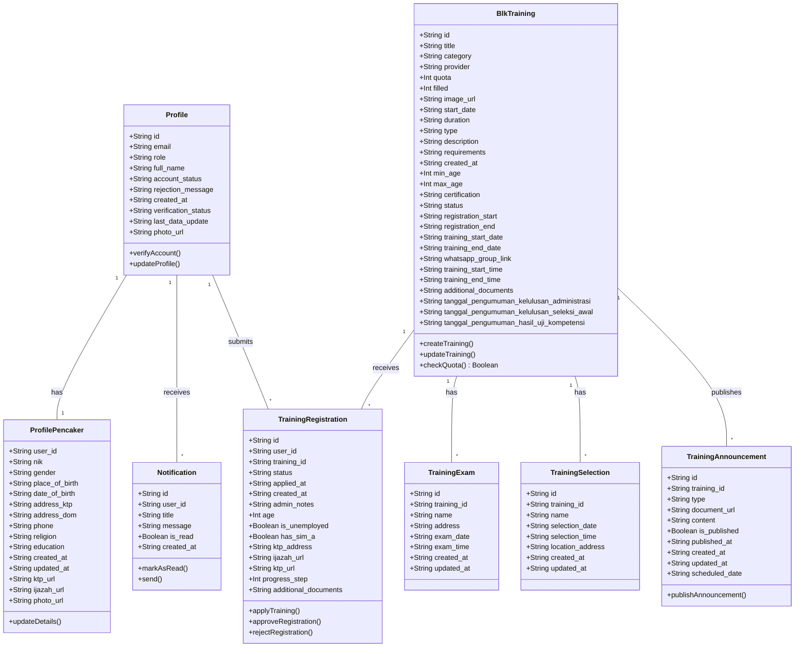

```mermaid
classDiagram
  class Profile {
    +String id
    +String email
    +String role
    +String full_name
    +String account_status
    +String rejection_message
    +String created_at
    +String verification_status
    +String last_data_update
    +String photo_url
    +verifyAccount()
    +updateProfile()
  }
  
  class ProfilePencaker {
    +String user_id
    +String nik
    +String gender
    +String place_of_birth
    +String date_of_birth
    +String address_ktp
    +String address_dom
    +String phone
    +String religion
    +String education
    +String created_at
    +String updated_at
    +String ktp_url
    +String ijazah_url
    +String photo_url
    +updateDetails()
  }

  class Notification {
    +String id
    +String user_id
    +String title
    +String message
    +Boolean is_read
    +String created_at
    +markAsRead()
    +send()
  }
  
  class BlkTraining {
    +String id
    +String title
    +String category
    +String provider
    +Int quota
    +Int filled
    +String image_url
    +String start_date
    +String duration
    +String type
    +String description
    +String requirements
    +String created_at
    +Int min_age
    +Int max_age
    +String certification
    +String status
    +String registration_start
    +String registration_end
    +String training_start_date
    +String training_end_date
    +String whatsapp_group_link
    +String training_start_time
    +String training_end_time
    +String additional_documents
    +String tanggal_pengumuman_kelulusan_administrasi
    +String tanggal_pengumuman_kelulusan_seleksi_awal
    +String tanggal_pengumuman_hasil_uji_kompetensi
    +createTraining()
    +updateTraining()
    +checkQuota() Boolean
  }
  
  class TrainingRegistration {
    +String id
    +String user_id
    +String training_id
    +String status
    +String applied_at
    +String created_at
    +String admin_notes
    +Int age
    +Boolean is_unemployed
    +Boolean has_sim_a
    +String ktp_address
    +String ijazah_url
    +String ktp_url
    +Int progress_step
    +String additional_documents
    +applyTraining()
    +approveRegistration()
    +rejectRegistration()
  }

  class TrainingExam {
    +String id
    +String training_id
    +String name
    +String address
    +String exam_date
    +String exam_time
    +String created_at
    +String updated_at
  }

  class TrainingSelection {
    +String id
    +String training_id
    +String name
    +String selection_date
    +String selection_time
    +String location_address
    +String created_at
    +String updated_at
  }

  class TrainingAnnouncement {
    +String id
    +String training_id
    +String type
    +String document_url
    +String content
    +Boolean is_published
    +String published_at
    +String created_at
    +String updated_at
    +String scheduled_date
    +publishAnnouncement()
  }

  Profile "1" -- "1" ProfilePencaker : has
  Profile "1" -- "*" Notification : receives
  Profile "1" -- "*" TrainingRegistration : submits
  BlkTraining "1" -- "*" TrainingRegistration : receives
  BlkTraining "1" -- "*" TrainingExam : has
  BlkTraining "1" -- "*" TrainingSelection : has
  BlkTraining "1" -- "*" TrainingAnnouncement : publishes
```
